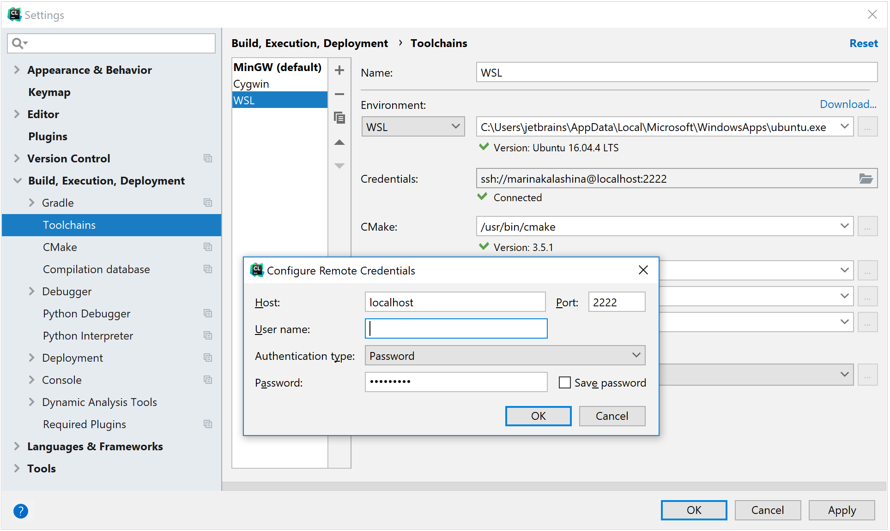

# JetBrains CLion Working with WSL Environment

REF: https://www.jetbrains.com/help/clion/how-to-use-wsl-development-environment-in-clion.html

Suppose you need to use Linux toolchain to build a project on your Windows machine. You can use Cygwin for that, but now you can try another solution - [Microsoft Subsystem for Linux](https://docs.microsoft.com/en-us/windows/wsl/about) (WSL). WSL is a compatibility layer for running Linux binary executables natively on Windows 10; for now it supports Ubuntu, OpenSUSE and SLES distributions.

With WSL deployed on your system, you are able to use CMake, C and C++ compilers from Linux in CLion running on your Windows machine.

## Getting Started

Let’s start with the simple instruction on how to set up the WSL environment in CLion: 

1. Download and install WSL distribution (for instance, Ubuntu) from [Microsoft Store.](https://www.microsoft.com/store/productId/9NBLGGH4MSV6)

2. Run Ubuntu. **Note:** upon the first lunch of Ubuntu the system may prompt you to enable the Windows optional feature. In this case, you need to: 

   * Open Windows Power Shell as Administrator and run the following: 

     ```powershell
     PS > Enable-WindowsOptionalFeature -Online -FeatureName Microsoft-Windows-Subsystem-Linux
     ```

   * Restart your computer.

3. Create a new user and specify your user name and password.

4. Set up WSL Ubuntu environment: 

   * Install cmake, gcc, or/and clang (and optionally `build-essentials` package), as follows: 

     ```bash
     $ sudo apt-get install cmake gcc gdb build-essential
     ```

   * Configure and run open ssh-server.
     You can set the configuration manually or by using our script (note that if your Linux distribution is different from Ubuntu, the script might need adjustments). To download and run the script, use the following command line:

     ```bash
     $ wget https://raw.githubusercontent.com/codeninja55/linux-configurations-and-guides/master/windows-10-wsl/ubuntu_setup_env.sh -P ~/
     ```

   * Make the script executable and run

     ```bash
     $ sudo chmod +x ~/ubuntu_setup_env.sh && ~/ubuntu_setup_env.sh
     ```

   5. Next, check up the `ssh` connection: 

      ```
      ssh username@localhost -p 2222
      ```

      **Note:** port number 2222 is valid for our configuration script. If you are not using our script, the port number can be different. 

   6. Now you can run CLion and [create a toolchain](https://www.jetbrains.com/help/clion/how-to-create-toolchain-in-clion.html) for WSL: 

      


### Current issues and limitations: 

Due to the [IntelliJ platform issue](https://youtrack.jetbrains.com/issue/IDEA-135546), there is an issue with WSL file-system which is case-sensitive and Windows FS which is not. As workaround you can do the following: 

* Go to **Help | Edit Custom properties...** menu option and specify the following: 

  ```
  idea.case.sensitive.fs=true
  ```

* Invalidate caches and restart the IDE using **File | Invalidate Caches and Restart** menu option.